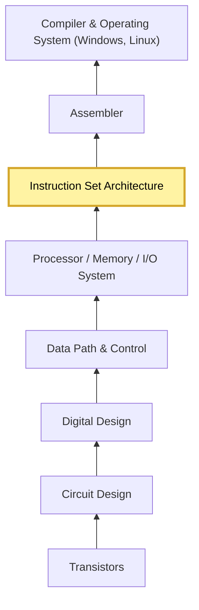

Date: Thursday, Sept 24, 2026

# Bottom-UP | Computer Architecture ISA
Before getting into Operating Systems, we need to understand Computer Architecture so we can have a better foundation before we can work on OS. 

The professor shows a diagram of layers of the computer starting at the bottom with transistors -> circuit design -> digital design -> data path & control -> Processor/Memory/IO System -> Instruction Set Architecture (Highlighting now) -> Assembler -> Compiler And Operating System (Win, Linux)

# Computer System Hardware
John Von Neumann (1903 - 1957)
- Super smart 
- By his death 53, has not only revolutionalize math and physisc but also made foundational contributions to puer economics and statics computing ?? 

# x86 Architecture
1978, Intel first 16-bit processor, 8086

This is the ancertor of AI-32 processor 
All later processor are backward compatible with it. 

## 8086 Architecture
8086 is 16-bit Real Mode. What is Real Mode ?? 
a program can access/ modify all addressable memory, I/O addresses and other hardware. The professor says "this is not safe". No support for memory protection, multitasking, or code privilege levels. 

Note: real mode cannot run modern OS