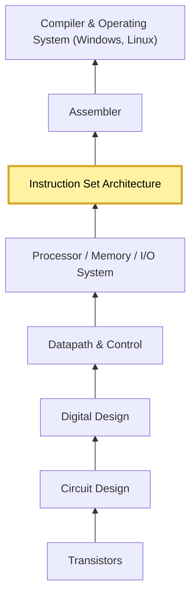

Date: Thursday, Sept 24, 2026

# Bottom-Up | Computer Architecture ISA

Before getting into operating systems, we need to understand computer architecture so we have a better foundation for OS concepts.

## Computer Layers (Bottom-Up)

The professor showed a diagram of computer layers, starting at the bottom with transistors and moving upward to software:

- Transistors → circuit design → digital design → datapath and control → processor, memory, and I/O system → **Instruction Set Architecture (ISA)** → assembler → compiler and operating system (e.g., Windows, Linux).

> [!info] ISA
> The **Instruction Set Architecture (ISA)** is the interface between software and the processor. It specifies the instructions, registers, data types, and behavior that programs can rely on.


```mermaid
flowchart BT
    T[Transistors] --> CD[Circuit Design]
    CD --> DD[Digital Design]
    DD --> DPC[Datapath & Control]
    DPC --> PMIO[Processor / Memory / I/O System]
    PMIO --> ISA[Instruction Set Architecture]
    ISA --> ASM[Assembler]
    ASM --> COS["Compiler & Operating System (Windows, Linux)"]

    classDef highlight fill:#fff3a3,stroke:#d4a72c,stroke-width:3px,color:#000;
    class ISA highlight;
```

## Computer System Hardware

**John von Neumann (1903–1957)** made foundational contributions to mathematics, physics, economics, statistics, and computing.

### x86 Architecture

- In 1978, Intel introduced the **8086**, its first 16-bit processor.
- The 8086 is an ancestor of the IA-32 (32-bit x86) architecture.
- Later x86 processors generally maintain backward compatibility with 8086 software.

#### 8086 Architecture

The 8086 uses a 16-bit programming model and the real-address-mode memory model later preserved by x86 processors.

> [!info] Real Mode
> **Real mode** (more precisely, *real-address mode*) provides direct access to the address space and I/O ports, with no memory protection, privilege levels, or hardware multitasking. It is therefore unsafe for a modern multi-user, multitasking OS. Modern OSs use protected mode (and, on 64-bit x86 systems, long mode) instead.

The professor showed and discussed an 8086 architecture diagram with these components:

- Code Segment (**CS**)
- Data Segment (**DS**)
- Instruction Pointer (**IP**)
- General-purpose registers
- Internal data bus
- Arithmetic Logic Unit (**ALU**)
- Instruction queue
- Bus interface

More on the 8086:

- An instruction is an encoded binary string.
- The CPU fetches and executes instructions one at a time.
- A binary pattern that is not a valid instruction encoding causes an invalid-opcode exception.

The CPU can access:

- **Byte:** 8 bits
- **Word:** 2 bytes (16 bits)
- **Double word:** 4 bytes (32 bits)
- **Quad word:** 8 bytes (64 bits)

> [!note]
> In RISC-V, a word is 4 bytes (32 bits); in 16-bit x86 terminology, a word is 2 bytes.

A 16-bit register can represent \(2^{16} = 65,536\) different values (64 Ki). The 8086, however, has a 20-bit address bus, which can address \(2^{20} = 1,048,576\) bytes (1 MiB).

> [!info] Address Bus
> The **address bus** carries the address of the memory location or I/O device that the CPU wants to access. Its width determines how many distinct addresses can be represented.

##### Segmentation

Segmentation lets 16-bit registers address the 8086's 1 MiB address space. It does **not** divide memory into 64 fixed sections: segments can overlap and each segment can be up to 64 KiB.

A program uses a logical address in the form `segment:offset`. The hardware forms the physical address dynamically:

```text
physical address = (segment × 16) + offset
```

## Protected Mode

In a multitasking, multi-user environment, multiple tasks reside in memory and must be isolated from one another to prevent accidental or unauthorized access.

- **1982:** The Intel 80286 introduced protected mode.
- **1985:** The Intel 80386 introduced 32-bit x86 registers and addressing.
- A 32-bit address can represent \(2^{32}\) bytes = 4 GiB of address space.

### Interrupts

Three types of interrupts/traps were discussed:

1. **Hardware interrupts** — generated by external devices.
2. **Exceptions (internal interrupts)** — generated by the CPU while executing an instruction.
3. **Software interrupts** — invoked explicitly, for example with the `INT` instruction.

Protected mode is a foundation of modern operating systems such as Windows and Linux. It provides:

- Virtual memory with paging
- Privilege levels (**rings 0–3**)
- Segment-based protection through access-permission checks
- Page-level permissions (read/write/execute and user/supervisor)
- Controlled interrupts and traps
- Restrictions on instructions executed in user mode

> [!info] Protected-mode mechanisms
> Protected mode relies on privilege levels and hardware memory protection. On the 80386 and later, paging is used to provide virtual memory and page-level permissions.

## Boot Sequence (x86)

When booting from a hard drive, the BIOS selects the boot device and loads its first sector into memory.

- The first sector of a traditional BIOS disk is **LBA 0** (historically cylinder 0, head 0, sector 1).
- This sector may contain a **Master Boot Record (MBR)**: bootstrap code, a partition table, and a boot signature.
- The BIOS transfers control to the boot code; that code then loads the next-stage bootloader or kernel.

> [!info] BIOS
> The **Basic Input/Output System (BIOS)** is firmware that initializes hardware, selects a boot device, and starts the boot process. On older systems it was stored in ROM; on modern systems it is typically stored in flash memory.

## RISC-V Architecture

The professor discussed a CPU-and-memory diagram with:

- Program Counter (**PC**)
- Registers
- Arithmetic Logic Unit (**ALU**)
- Memory access

The unprivileged RISC-V ISA alone is insufficient to build a full OS. An operating system also needs the **RISC-V privileged architecture**, which provides privilege modes, control and status registers, traps and interrupts, and memory-management support.

### RISC-V Unprivileged ISA

User-level instructions include:

```assembly
add x1, x2, x3
lw x3, 30(x4)
```

### RISC-V Privileged Architecture

The privileged architecture consists of privileged instructions and additional mechanisms needed by an OS.

### Booting RISC-V

A typical RISC-V boot sequence is platform-dependent, but commonly follows these steps:

1. Machine powers on.
2. Boot ROM executes boot code.
3. Firmware initializes low-level hardware and services.
4. A bootloader loads the kernel.
5. The kernel begins execution.
6. User programs run.

At startup, the CPU is in a primitive state:

- No page tables or virtual memory
- No kernel or user-space environment
- Hardware such as memory controllers, clocks, UARTs, and interrupt controllers may not yet be initialized

#### Boot ROM

**Boot ROM** is tiny, immutable code stored in a read-only chip. It runs first after reset and normally begins execution in the highest RISC-V privilege level, **machine mode (M-mode)**.

> [!note]
> A **UART** (**Universal Asynchronous Receiver/Transmitter**) is a hardware interface for serial communication. It transmits and receives data one bit at a time, typically over separate transmit (TX) and receive (RX) lines.

#### Firmware Execution

Firmware establishes the machine-mode (**M-mode**) runtime environment:

- Initializes essential low-level hardware and installs an M-mode trap handler.
- Configures machine-level state and delegates selected traps and interrupts to S-mode when appropriate.
- Provides the **Supervisor Binary Interface (SBI)**: the interface through which S-mode software requests platform services, such as timers, interprocessor interrupts, hart management, and system reset.
- Loads and transfers control to the next stage, such as a bootloader (for example, U-Boot) or directly to a kernel.

RISC-V hardware does not mandate a particular SBI implementation. **OpenSBI** is a common open-source M-mode firmware implementation. Firmware is the main user of privileged M-mode ISA features and has the highest level of hardware access.

#### Bootloader

- A bootloader is a small program separate from the kernel; the kernel has not yet been loaded.
- It prepares the kernel's environment and loads the kernel image, often together with a device tree and an initial RAM filesystem.
- It is commonly supplied by platform or operating-system software; **U-Boot** is a widely used example.
- It may run in M-mode or S-mode, depending on the platform and whether firmware already provides an SBI.
- It transfers control to the kernel's entry point, usually low-level assembly code such as `entry.S`.

#### Kernel Execution

- The kernel entry assembly code sets up an initial stack and performs early architecture-specific initialization.
- The kernel initializes memory regions, builds early page tables, and programs `satp` when virtual memory is enabled.
- It sets `stvec` to install an S-mode trap handler and configures supervisor interrupt and status bits.
- It then transfers to the kernel's C entry point (for example, `start_kernel()` or `main()`).

#### User Program Execution

- The OS creates the first user process.
- It loads an **ELF executable** into the process's user virtual memory.
- It creates a trap frame for the process and switches to its page table.
- It sets the return program counter and privilege state, then executes `sret` to return from S-mode to U-mode (user mode).

- An **Application Execution Environment (AEE)** is the environment provided to an application, usually by the OS. An application uses an **Application Binary Interface (ABI)** to interact with that environment.
- A **Supervisor Execution Environment (SEE)** is the higher-privilege environment provided to an OS. The OS uses the **Supervisor Binary Interface (SBI)** to interact with it.
- On many systems, M-mode firmware such as OpenSBI implements the SEE; on virtualized systems, a hypervisor can provide it instead.

### RISC-V Privilege-Mode Encoding

In the two-bit `MPP` (previous privilege mode) encoding:

| Bits | Privilege mode | Meaning |
| --- | --- | --- |
| `00` | User mode (**U-mode**) | Runs application code with the least privilege. |
| `01` | Supervisor mode (**S-mode**) | Runs the operating-system kernel. |
| `10` | Reserved | Not assigned to a standard privilege mode. |
| `11` | Machine mode (**M-mode**) | Highest privilege; runs low-level firmware and machine-level control code. |


# References
- [Intel Software Developer’s Manual](https://www.intel.com/content/www/us/en/developer/articles/technical/intel-sdm.html)
- [RISC-V privileged architecture specification](https://docs.riscv.org/reference/isa/priv/priv-intro.html)
- [RISC-V Supervisor Binary Interface specification](https://docs.riscv.org/reference/sbi/intro.html)

## To Do
Look at the XV6, a simple UNIX-like operating system.